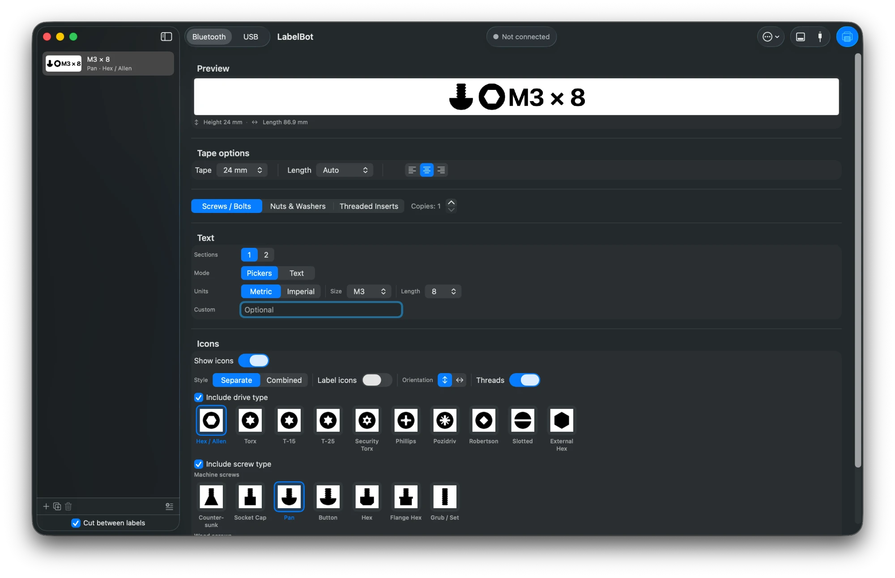

# LabelBot

A native macOS app for designing and printing fastener labels on a **Brother
PT-P710BT** ("P-touch Cube Plus"), built for labeling **Gridfinity** bins —
screws, bolts, nuts, washers, and threaded inserts.



## Features

- **Purpose-built fastener labels** — pick a category (Screws / Bolts, Nuts &
  Washers, Threaded Inserts) and the drive and screw-head icons are drawn from
  code (CoreGraphics), so they stay crisp at any tape size.
- **Rich icon set** — drive types (Hex/Allen, Torx, T-15, T-25, Security Torx,
  Phillips, Pozidriv, Robertson, Slotted, External Hex) and machine/wood screw
  heads, with a *Separate* (head + drive) or *Combined* (single bolt) style,
  optional per-icon captions, orientation, and thread rendering.
- **Flexible text** — one or two independent text sections, sized from guided
  metric/imperial pickers or entered as free text, plus an optional custom line.
- **Length control** — Auto (fit to content), fixed millimeter presets, or
  Gridfinity units (0.5 GU steps). When a fixed length is chosen, the text and
  icons shrink to fit within it. The live preview reports the printed height and
  length in mm.
- **Batch printing** — a label queue with reordering, duplication, per-label
  copies, and "cut between labels"; bulk-add many labels from a pasted list; and
  save/load whole batches as JSON.
- **Two transports** — USB and Bluetooth Classic (SPP/RFCOMM), behind one
  protocol, with printer status reporting (cover open, no/wrong tape, etc.).

## Requirements

- macOS (Apple Silicon or Intel) and Xcode to build.
- A Brother PT-P710BT with TZe tape (3.5–24 mm).
  - **Bluetooth:** pair the printer in System Settings first (it uses Bluetooth
    *Classic*, not BLE).
  - **USB:** connect directly (Brother vendor id `0x04F9`).

## Build & run

```sh
open LabelBot.xcodeproj    # then ⌘R in Xcode
```

or from the command line:

```sh
xcodebuild -project LabelBot.xcodeproj -scheme LabelBot -configuration Debug build
```

## How it works

The PT-P710BT has no third-party SDK; it's driven with Brother's documented
**raster command language** (a byte protocol). Everything is rendered in pure
Swift — no external dependencies — at the printer's native **180 dpi**, with a
raster line of **128 dots (16 bytes)**.

```
LabelRenderer     LabelSpec + TapeSize   →  1-bit bitmap          (CoreText / CoreGraphics)
IconRenderer      fastener options       →  drive / head icons    (CoreGraphics)
RasterEncoder     bitmap(s)              →  Brother raster Data    (ESC-command packer)
PrinterTransport  protocol { connect / send / readStatus / disconnect }
   ├─ USBTransport         (IOKit / IOUSBHost bulk endpoint)
   └─ BluetoothTransport   (IOBluetooth RFCOMM / SPP)
PrinterManager    @Observable — queue, connection state, printing
ContentView       SwiftUI editor: preview · tape · category · text · icons
```

A batch prints as a single job: the print-info header is sent per page, pages are
separated by the print terminator (`0x0C`) with auto-cut between them, and the
final page ends with print-and-feed (`0x1A`).

### Protocol references

- Brother [Software Developer's Manual (raster)](https://download.brother.com/welcome/docp100064/cv_pte550wp750wp710bt_eng_raster_102.pdf)
- [treideme/brother_pt](https://github.com/treideme/brother_pt) — raster impl, P710BT verified
- [robby-cornelissen/pt-p710bt-label-maker](https://github.com/robby-cornelissen/pt-p710bt-label-maker) — PNG→raster over Bluetooth
